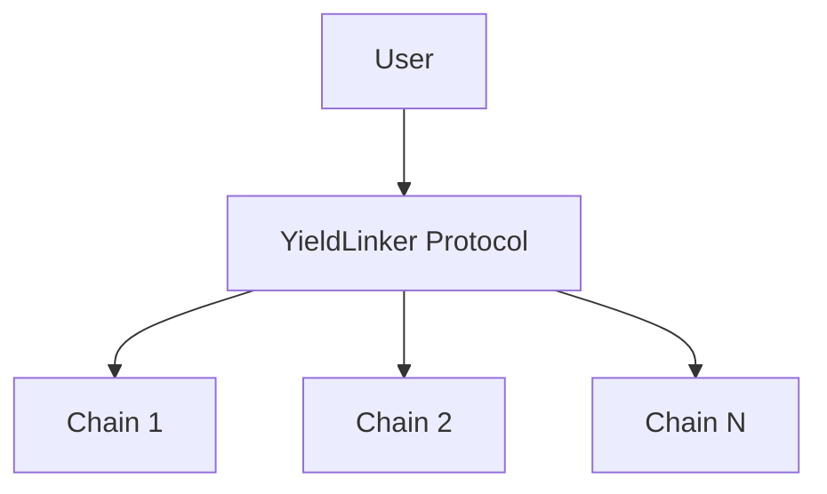

# YieldLinker

A cross-chain yield aggregation protocol that enables seamless yield farming across multiple blockchain networks.

## Overview

YieldLinker is a smart contract protocol designed to optimize DeFi yields by automatically routing and managing assets across different blockchain networks. It provides a unified interface for users to maximize their returns while minimizing gas costs and complexity.

## Features

- 🔄 Cross-chain yield optimization
- 🔐 Secure token bridging
- 📊 Automated yield tracking
- ⚡ Gas-efficient operations
- 🌐 Multi-network support
- 💰 Yield aggregation strategies

## Installation

```bash
npm install
```

## Configuration

Create your configuration files in the settings directory:
- `Mainnet.toml` for production
- `Testnet.toml` for testing

## Usage

### Deploy Contracts

```bash
npm run deploy:testnet   # Deploy to testnet
npm run deploy:mainnet   # Deploy to mainnet
```


## Security

- All contracts are pending audit
- Built with security-first approach
- Implements standard security practices
- Regular security updates

## Architecture



## Contributing

1. Fork the repository
2. Create feature branch (`git checkout -b feature/amazing-feature`)
3. Commit changes (`git commit -m 'Add amazing feature'`)
4. Push to branch (`git push origin feature/amazing-feature`)
5. Open a Pull Request


